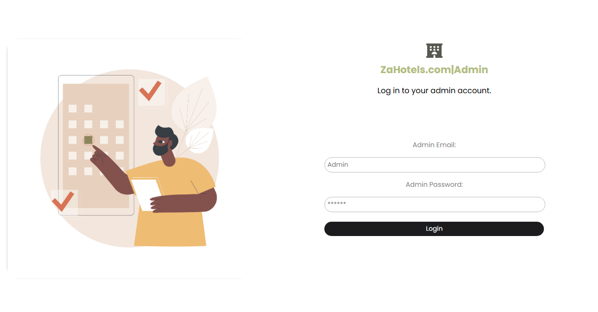
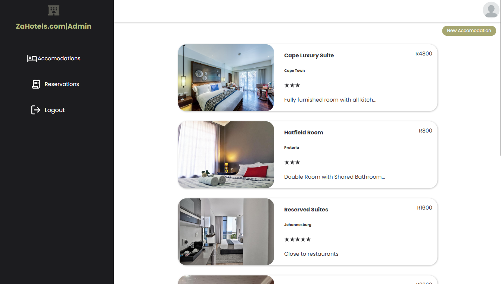

# React + Firebase Hotel Booking App | ADMIN

React hotel booking/management app using firebase as storage and database. This is the admin side of the web app, where admins can add and manage hotel rooms.

## Installation

1. Clone the repository

```bash
git@github.com:Lspacedev/hotel-booking-app-admin.git
```

2. Navigate to the project folder

```bash
cd hotel-booking-app-admin
```

3.  Install all dependencies

```bash
npm install
```

4. Create an env file and add Firebase SDK config keys (go to /src/config/firebase.jsx for variable naming)
5. Run the project

```bash
npm run dev
```

## Screenshot




## Features

- Authentication: Login to Admin account.

Hotels

- View all hotel rooms.
- Add new hotel room.
- Update hotel room information.
- Remove existing hotel room.

Reservations

- View all hotel room reservations.
- View reservation details.
- Approve reservation.
- Reject reservation.

## Usage

1. Open the live site in your browser.
2. Navigate to the login page.
3. Press login button **_ Note that the Admin Crendentials are already inputted, theres no admin account creation _**
4. Once in the dashboard, you can manage both accomodations/rooms and reservations.

## Tech Stack

- ReactJs
- Firebase

## Credits:

```python
Photo by Jimmy Chan: https://www.pexels.com/photo/several-lighted-high-rise-buildings-933337/
<a href="https://www.freepik.com/free-vector/planning-illustration_19635378.htm#fromView=author&page=2&position=48&uuid=9282d6e1-7d19-423f-9db3-7a65fadf192c">Image by vectorjuice on Freepik</a>
```

## Flows:

```python
https://www.figma.com/board/CJ0hyIKh69osFRaYgrpzGJ/Hotel-App-User-Flow?node-id=0-1&node-type=canvas
```
